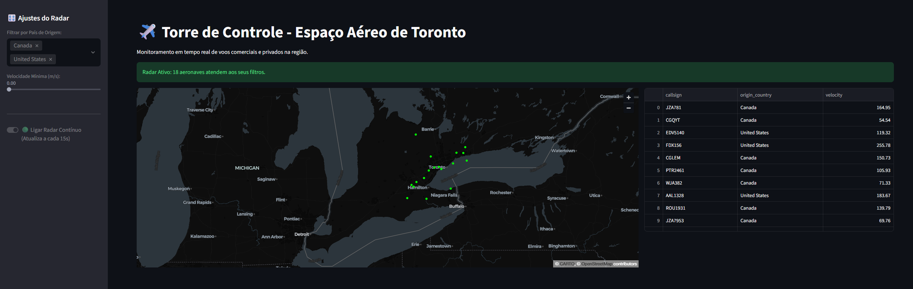

🌎 *Leia em [Português](README.md)*

# ✈️ Toronto Airspace Control Tower - Real-Time Data Pipeline


<div align="center">
  
</div>

## 📌 Project Overview
This project simulates an Air Traffic Control Tower, performing continuous monitoring of commercial and private flights in the Toronto, Canada region. The main goal was to build an end-to-end Data Engineering pipeline, from real-time data ingestion using an external API to interactive visualization in an analytical dashboard.

## 🏗️ Data Architecture (Medallion Architecture)
Data processing was structured using the Medallion Architecture within the **Databricks** environment, ensuring quality and reliability:

* **🥉 Bronze Layer (Ingestion):** Extraction of raw JSON data via `requests` directly from the **OpenSky Network API**, capturing coordinates, velocity, country of origin, and callsigns of aircraft within the Toronto bounding box.
* **🥈 Silver Layer (Processing and Cleaning):** Use of **PySpark** to transform the complex JSON structure into a tabular DataFrame. Crucial business rules were applied, such as exclusively filtering aircraft in flight (`on_ground == false`) and removing records with null coordinates.
* **🥇 Gold Layer (Serving):** The refined data is saved and continuously overwritten in a final table (`gold_radar_toronto`), optimized for frontend application consumption.

## 📊 Interactive Dashboard (Frontend)
The user interface was developed in **Streamlit**, connecting directly to the Databricks SQL Warehouse. Features include:
* **Geospatial Map:** Real-time plotting of aircraft latitude and longitude.
* **Dynamic Filters:** Ability to segment flights by Country of Origin and Minimum Velocity (Pandas).
* **Live Mode:** Implementation of an update loop to automatically refresh aircraft positions on the radar.

## 📂 Repository Structure
* `radar.py`: Main Streamlit dashboard script and connection logic via `databricks-sql-connector`.
* `notebook_databricks.py`: PySpark data extraction and processing pipeline (Bronze/Silver/Gold Layers).
```
